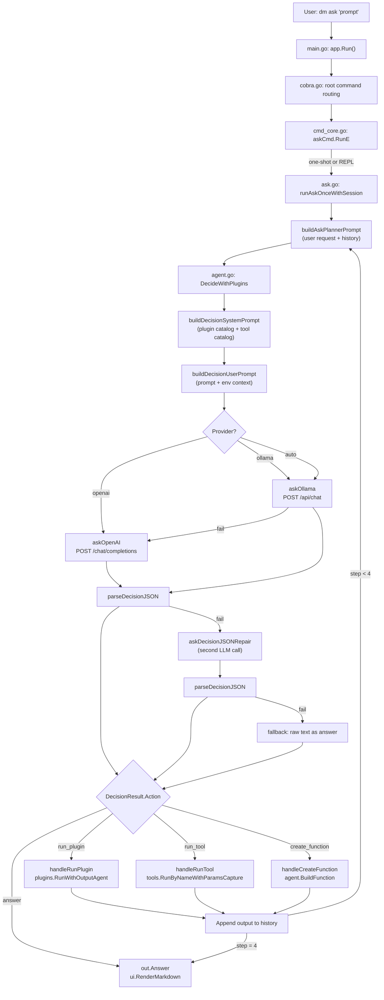

# dm CLI — Codebase Reference

> Fonte unica di verita sul progetto. Aggiornato: 23 Feb 2026.

---

## 1. Tech Stack

| Layer | Technology | Version / Notes |
|-------|-----------|-----------------|
| Language | Go | 1.24.1 |
| CLI framework | `github.com/spf13/cobra` | v1.8.1 |
| PDF extraction | `github.com/ledongthuc/pdf` | used in `tools/grep.go` |
| Terminal helpers | `golang.org/x/term` | raw mode, size detection |
| Plugin runtime | PowerShell | `.ps1` toolkits, executed via `pwsh`/`powershell` |
| LLM providers | OpenAI API, Ollama `/api/chat` | configurable via `dm.agent.json` |
| CI | GitHub Actions | `golangci-lint`, `go test`, `go vet` (ubuntu + windows) |
| Config | `dm.agent.json` | provider, model, base_url, API keys |
| Pre-push hook | `scripts/pre-push.ps1` | `go test` + `golangci-lint` before push |

---

## 2. Folder Structure

```
dm_cli/
├── main.go                  # Entry point: os.Exit(app.Run(os.Args[1:]))
├── dm.agent.json            # User LLM config (provider, model, keys)
├── dm.agent.example.json    # Template for dm.agent.json
├── go.mod / go.sum
├── AGENTS.md                # AI agent guidelines for this repo
├── README.md / README.txt
├── .golangci.yml            # Linter config
│
├── internal/
│   ├── agent/               # LLM decision engine (2 src + 2 test)
│   │   ├── agent.go         #   AskWithOptions, DecideWithPlugins, JSON repair
│   │   └── toolkit_builder.go #   BuildFunction (create_function action)
│   ├── app/                 # Cobra commands, ask loop, output (15 src + 5 test)
│   │   ├── cobra.go         #   Root Cobra command, app.Run()
│   │   ├── cmd_core.go      #   Subcommand registration (ask, doctor, plugins, tools...)
│   │   ├── ask.go           #   Multi-step agent loop (runAskOnceWithSession)
│   │   ├── ask_catalog.go   #   Plugin/tool catalog builder for LLM prompt
│   │   ├── ask_output.go    #   TTY + JSON output writers
│   │   ├── ask_risk.go      #   Risk assessment (low/medium/high)
│   │   ├── ask_helpers.go   #   Prompt building, token budget, file context
│   │   ├── ask_toolkit_writer.go # create_function file writer
│   │   ├── plugin_menu.go   #   Interactive plugin selection menu
│   │   └── ...              #   shortcuts, signal, version, help_templates, etc.
│   ├── plugins/             # Plugin discovery + execution (4 src + 2 test)
│   │   ├── plugins.go       #   ListEntries, GetInfo, Run, RunWithOutputAgent
│   │   ├── plugins_exec.go  #   PowerShell/script execution, splatting
│   │   ├── plugins_parse.go #   .ps1 help/param block parsing
│   │   └── cache.go         #   File-stamp based entry cache
│   ├── ui/                  # Terminal UI (4 src + 2 test)
│   │   ├── pretty.go        #   ANSI colors (Accent, OK, Warn, Error, Muted)
│   │   ├── markdown.go      #   RenderMarkdown (bold, code, headers, lists)
│   │   ├── spinner.go       #   Animated spinner for "Thinking..."
│   │   └── splash.go        #   ASCII logo + version splash
│   ├── filesearch/          # Recursive file finder (1 src, 0 test)
│   ├── renamer/             # Batch rename engine (1 src + 1 test)
│   ├── systeminfo/          # OS/network snapshot (1 src + 1 test)
│   ├── platform/            # OS-specific open/launch (1 src, 0 test)
│   └── doctor/              # Diagnostics: config, provider, plugins (1 src, 0 test)
│
├── tools/                   # Built-in tools (10 src + 3 test)
│   ├── menu.go              #   ToolRegistry, dispatch (RunByName, RunByNameWithParamsCapture)
│   ├── search.go            #   File search by name (substring match)
│   ├── grep.go              #   Content search (text + PDF support)
│   ├── read.go              #   Read file / list directory
│   ├── diff.go              #   Git diff / file compare
│   ├── recent.go            #   Recently modified files
│   ├── clean.go             #   Empty folder removal
│   ├── rename.go            #   Batch rename (delegates to renamer/)
│   ├── system.go            #   System snapshot (delegates to systeminfo/)
│   └── paging_cache.go      #   Offset/limit paging state
│
├── plugins/                 # PowerShell toolkits (22 .ps1 files)
│   ├── *.ps1                #   13 general-purpose toolkits
│   ├── M365/                #   6 Microsoft 365 toolkits
│   └── STIBS/               #   3 STIBS application toolkits
│
├── scripts/                 # Build/release/CI helpers
│   ├── pre-push.ps1         #   Pre-push quality gate
│   ├── install.ps1          #   Installation script
│   ├── release.ps1          #   Release automation
│   └── dm.ps1               #   PowerShell wrapper
│
├── docs/                    # Documentation
│   ├── roadmap.md           #   Feature roadmap with priorities
│   └── *.md                 #   Cheatsheets
│
├── config/                  # (reserved, currently empty)
└── .github/workflows/ci.yml # GitHub Actions CI pipeline
```

**File counts:** 40 Go source + 19 test/bench = 59 `.go` files total.

---

## 3. Data Flow

### `dm ask` — from prompt to answer



### Agent decision engine parameters

| Parameter | Value | Purpose |
|-----------|-------|---------|
| `temperature` | 0.2 | Near-deterministic responses |
| `max_tokens` | 1024 | Bounded response size |
| `response_format` | `json_object` (OpenAI) / `format: json` (Ollama) | Structured output |
| System prompt | Plugin catalog + tool catalog + 7-step reasoning | Decision guidance |
| User prompt | User request + action history + env context | Task context |
| Max steps | 4 | Loop limit per turn |
| Response mode | `raw-first` (default), `llm-first` | Controls whether successful tool/plugin runs print only raw output or also LLM commentary |
| Token budget | 6000 (catalog) / 20000 (prompt) | Size warnings |

### Plugin execution path

1. `GetInfo(baseDir, name)` validates plugin exists and parses metadata
2. `missingMandatoryParams()` checks required args from `ParamDetail`
3. `pluginArgsToPS()` converts `map[string]string` to `-Name Value` form
4. `RunWithOutputAgent()` -> `runPowerShellFunctionCapture()`:
   - Creates temp `.ps1` with UTF-8 + StrictMode + ErrorActionPreference=Stop
   - Dot-sources toolkit file(s), builds `$dmNamedArgs` hashtable
   - Calls function via splatting: `& 'func_name' @dmNamedArgs`
   - Captures stdout+stderr, 5-minute timeout

### Tool execution path

1. `RunByNameWithParamsCapture()` redirects `os.Stdout` via `os.Pipe()`
2. `RunByNameWithParamsDetailed()` dispatches to `Run*AutoDetailed()` by tool name
3. Stdout captured in buffer -> stored in `AutoRunResult.Output`
4. Supports pagination via `CanContinue` + `ContinueParams`

---

## 4. Entry Points

### CLI commands

| Command | Handler | Description |
|---------|---------|-------------|
| `dm` (no args) | `cobra.go: rootCmd` | Splash screen (version, build time) |
| `dm ask <prompt>` | `cmd_core.go: askCmd` | AI agent (REPL or one-shot). Flags: `--provider`, `--model`, `--base-url`, `--scope`, `--json`, `-f`, `--risk-policy`, `--response-mode` |
| `dm doctor` | `cmd_core.go: doctorCmd` | Diagnostics (config, provider, plugins, paths) |
| `dm plugins [list\|info\|run\|menu]` | `cmd_core.go` | Plugin management and execution |
| `dm tools [name]` | `cmd_core.go` | Built-in tools (search, rename, recent, clean, system, read, grep, diff) |
| `dm ps_profile` | `cmd_core.go` | Show PowerShell $PROFILE symbols |
| `dm open ps_profile` | `cmd_core.go` | Open $PROFILE in editor |
| `dm help [topic]` | `cmd_core.go` | Help for commands or plugin functions |
| `dm completion` | `cmd_completion.go` | Shell completions (bash/zsh/fish/powershell) |

### Shortcuts

| Flag | Expands to |
|------|-----------|
| `dm -t` / `--tools` | `dm tools` |
| `dm -p` / `--plugins` | `dm plugins` |
| `dm -o` / `--open` | `dm open` |

### Implicit plugin dispatch

If Cobra doesn't recognize a subcommand, `runPluginOrSuggest()` tries to run it as a plugin function. Example: `dm stibs_app_status` directly executes the `stibs_app_status` function.

### Built-in tools (ToolRegistry)

| Tool | Key | Risk | Agent args |
|------|-----|------|-----------|
| search | s | low | base, ext, name, sort, limit, offset |
| rename | r | medium | base, from, to, name, case_sensitive |
| recent | e | low | base, limit, offset |
| clean | c | low | base, apply |
| system | y | low | (none) |
| read | f | low | path, offset, limit |
| grep | g | low | pattern, base, ext, limit, case_sensitive |
| diff | d | low | mode, limit, file_a, file_b |

### Plugin toolkits (22 files)

| Toolkit | Prefix | Domain |
|---------|--------|--------|
| FileSystem Path | `fs_path_*` | Windows system paths |
| System | `sys_*` | OS and local network |
| Docker | `dc_*` | Docker Compose |
| Browser | `browser_*` | Browser management |
| Excel | `xls_*` | Excel file operations |
| Text | `txt_*` | Encoding, hashing, text conversion |
| Help | `help_*` | Introspection, quickref, env vars |
| Toolkit Manager | `tk_*` | Toolkit lifecycle management |
| Start Dev | `start_*` | Dev tool launchers |
| Network | `net_*` | HTTP, download, network diagnostics |
| Winget | `pkg_*` | Windows package management |
| Archive | `arc_*` | Archive compress/extract |
| Scheduler | `sched_*` | Windows Task Scheduler |
| M365 Auth | `m365_*` | Microsoft 365 authentication |
| SharePoint | `spo_*` | SharePoint Online |
| Power Automate | `flow_*` | Power Automate flows |
| Power Apps | `pa_*` | Power Apps management |
| KVP Star Site | `kvpstar_*` | Specific SharePoint site |
| Star IBS Applications | `star_ibs_*` | Specific SharePoint site |
| STIBS App | `stibs_app_*` | App inspection and monitoring |
| STIBS DB | `stibs_db_*` | MariaDB analytics |
| STIBS Docker | `stibs_docker_*` | Docker stack STIBS |

---

## 5. TODO / Debito Tecnico

### Roadmap aperta

| # | Feature | Priorita | Effort |
|---|---------|----------|--------|
| 1 | Persistent conversation history (`--resume`, `dm history`) | Alta | Alto |
| 5 | Stdin/pipe support (`echo ... \| dm ask`) | Alta | Medio |
| 7 | `dm config set/show` CLI | Media | Basso |
| 8 | System prompt personalizzabile in `dm.agent.json` | Media | Basso |
| 9 | Markdown table rendering in `ui/markdown.go` | Media | Medio |
| 10 | Max steps configurabile (`--max-steps`) | Media | Basso |
| 12 | HTTP fetch tool per l'agente | Strategica | Medio |
| 13 | Alias/macro system | Strategica | Medio |
| 14 | `dm init` setup wizard | Strategica | Medio |
| 15 | Multi-provider profiles (`--profile`) | Strategica | Alto |
| 16 | Undo per operazioni distruttive | Strategica | Alto |

### Test coverage gaps

| Package | Status |
|---------|--------|
| `tools/` (grep, read, diff, clean, rename, system, menu) | Solo `search_test.go` + `paging_cache_test.go` |
| `internal/platform/` | Nessun test |
| `internal/filesearch/` | Nessun test |
| `internal/doctor/` | Nessun test |
| `internal/app/ask_risk.go` | Nessun test |
| `internal/app/ask_output.go` | Nessun test |
| `internal/app/plugin_menu.go` | Nessun test |

### Debito tecnico

| Issue | File/Area | Severity |
|-------|-----------|----------|
| No `context.Context` in HTTP/LLM calls (no cancellation, no timeout propagation) | `internal/agent/agent.go` | Media |
| Magic numbers hardcoded: `askMaxSteps=4`, `catalogTokenBudget=6000`, `promptTokenBudget=20000`, `decisionMaxTokens=1024`, `httpTimeout=60s` | `internal/app/ask.go`, `agent.go` | Bassa |
| `interface{}` usato al posto di `any` (4 occorrenze) | `internal/systeminfo/systeminfo.go` | Bassa |
| LLM request bodies via `map[string]any` invece di struct tipizzate | `internal/agent/agent.go` | Bassa |
| `auto` provider swallows Ollama error silently on fallback | `internal/agent/agent.go:116-120` | Bassa |
| `fmt.Print*` diretto invece di `ui.*` in alcuni package | `tools/`, `internal/app/` | Bassa |
| Roadmap "Top 3" table has duplicate entry (stdin listed twice) | `docs/roadmap.md` | Triviale |
